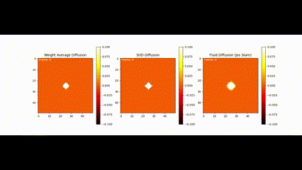

# Fluid Simulation Using Grid-Based Method

This Python script simulates fluid dynamics using a grid-based method. It uses the Navier-Stokes equations for fluid motion and the advection-diffusion equation for density.

### Diffuse Simulation


### Lagrangian versus Eulerian


### Fluid with High Viscocity - Honey High intensity


### Fluid with Low Viscocity - Gas State


## Requirements

- Python 3.x
- NumPy
- Matplotlib
- IPywidgets

## How to Run

1. Install the required libraries if you haven't already:

    ```bash
    pip install numpy matplotlib ipywidgets
    ```

2. Download the Python script `fluid_simulation.py`.

3. Run the script using Python:

    ```bash
    python fluid_simulation.py
    ```

4. Once the script is running, an interactive widget will appear. Adjust the viscosity and diffusion parameters using the sliders to observe different fluid behaviors.

## Explanation

- The script initializes parameters such as grid size, time step, diffusion, and viscosity.

- It defines functions for initializing grids, setting boundaries, solving linear equations, and simulating diffusion, advection, and projection.

- The `update` function is called in each animation frame to update the density and velocity fields based on the current parameters.

- The simulation is visualized using Matplotlib with density and velocity grids displayed in separate subplots.

- The interactive widget allows users to adjust viscosity and diffusion parameters in real-time to observe their effects on the fluid simulation.

- The figure title is set to "Fluid Simulation" to provide a clear visualization window.
